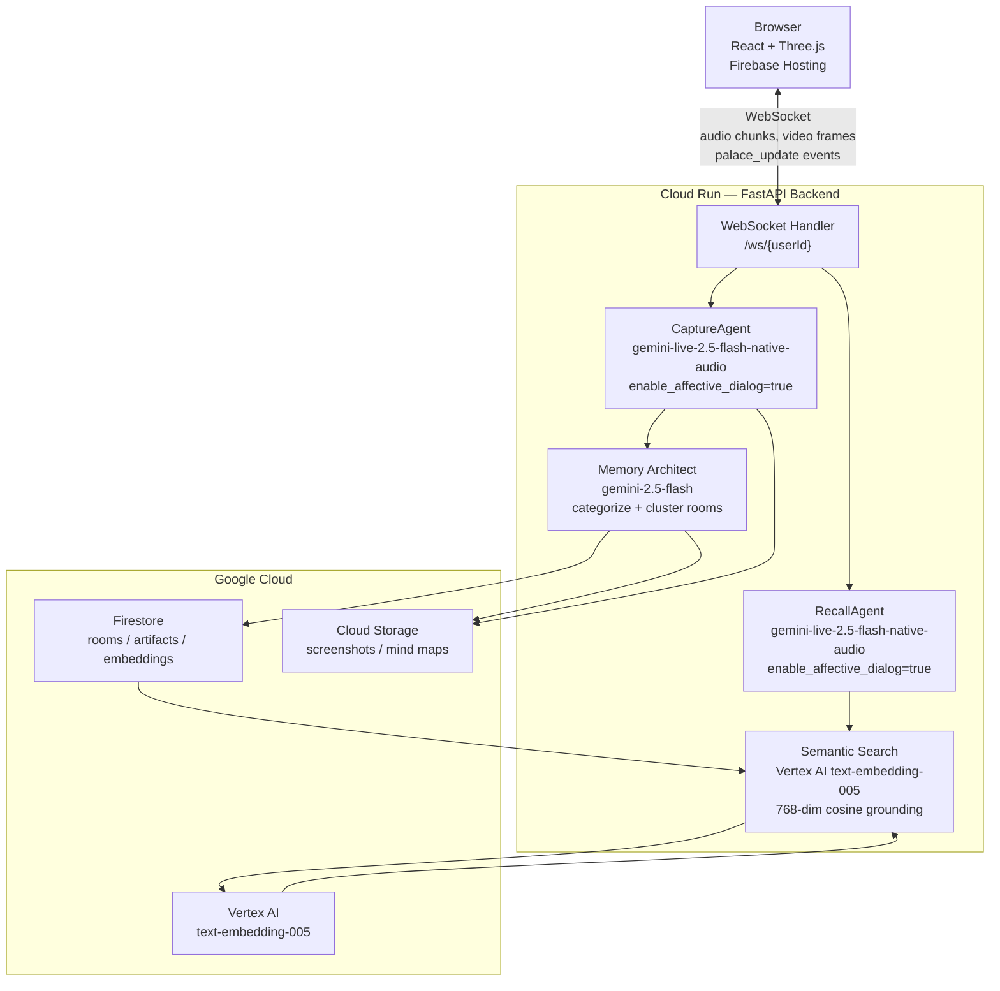

# Rayan — AI Memory Palace

**Gemini Live Agent Challenge submission — Live Agents category**

Rayan is a voice-first AI memory system that turns everything you hear, see, and say into a living 3D Memory Palace. Two persistent Gemini Live agents run simultaneously: one silently captures knowledge as you move through the world, and one lets you walk through your memories and have a natural voice conversation with them.

> **GDG Profile:** [g.dev/yelnady](https://g.dev/yelnady)

---

## What It Does

| Mode | Agent | Description |
|------|-------|-------------|
| **Capture** | `CaptureAgent` | Co-listens to lectures, meetings, and conversations via microphone and screen. Autonomously extracts key concepts and saves them as typed 3D artifacts, clustered into themed rooms in real time. |
| **Recall** | `RecallAgent` | Persistent voice session inside the 3D palace. You speak naturally; Rayan answers from your stored memories, navigates rooms, highlights the right artifact, and can save new memories mid-conversation. |

### Key Capabilities

- **Real-time multimodal capture** — audio (mic) and video frames (screen) streamed to Gemini Live simultaneously
- **Affective dialog** — both agents enable `enable_affective_dialog=True`, letting Rayan modulate its tone, pacing, and empathy based on your emotional state and speaking cadence
- **Semantic grounding** — every Recall response is grounded by Vertex AI `text-embedding-005` semantic search over all stored memories; Rayan cannot hallucinate answers that aren't in your palace
- **3D procedural palace** — rooms are auto-generated from topic clustering; 16 artifact types map to distinct 3D visuals (holograms, books, crystal orbs, framed images, speech bubbles, and more)
- **Screenshot capture** — the Capture agent calls `take_screenshot` when it sees a compelling diagram or slide, uploads to Cloud Storage, and places it as a framed visual artifact on the palace wall
- **Interruption-aware** — the Recall agent handles mid-sentence interruptions gracefully via Gemini Live's built-in VAD and the `interrupted` server event
- **Mind map synthesis** — `synthesize_room` generates an AI mind map image of all memories in a room using `gemini-2.5-flash-image`, rendered live on the 3D wall
- **Dedup and merge** — within-session duplicate concept detection using cosine similarity on `text-embedding-005` embeddings; near-duplicate captures are merged rather than duplicated

---

## Architecture

```
┌──────────────────────────────────────────────────────────────┐
│                       User's Browser                         │
│           React + Three.js  (Firebase Hosting)               │
│                                                              │
│  ┌────────────┐     WebSocket /ws/{userId}    ┌───────────┐  │
│  │ Capture UI │◄────────────────────────────► │           │  │
│  │ 3D Palace  │                               │ Cloud Run │  │
│  │ Voice UI   │◄────────────────────────────► │  FastAPI  │  │
│  └────────────┘                               │           │  │
└───────────────────────────────────────────────┼───────────┘  │
                                                │
                          ┌─────────────────────┼──────────────┐
                          │  Cloud Run — FastAPI │              │
                          │                     ▼              │
                          │  ┌──────────────────────────────┐  │
                          │  │ CaptureAgent                 │  │
                          │  │ gemini-live-2.5-flash-       │  │
                          │  │ native-audio                 │  │
                          │  │ enable_affective_dialog=True │  │
                          │  └──────────────┬───────────────┘  │
                          │                 │                   │
                          │  ┌──────────────▼───────────────┐  │
                          │  │ RecallAgent                  │  │
                          │  │ gemini-live-2.5-flash-       │  │
                          │  │ native-audio                 │  │
                          │  │ enable_affective_dialog=True │  │
                          │  └──────────────┬───────────────┘  │
                          │                 │                   │
                          │  ┌──────────────▼───────────────┐  │
                          │  │ Memory Architect             │  │
                          │  │ gemini-2.5-flash             │  │
                          │  │ categorize & cluster         │  │
                          │  └──────────────┬───────────────┘  │
                          └─────────────────┼──────────────────┘
                                            │
               ┌────────────────────────────┼──────────────────┐
               │  Google Cloud              │                  │
               │              ┌─────────────▼──────────────┐   │
               │              │  Firestore                 │   │
               │              │  users/{id}/rooms/         │   │
               │              │  users/{id}/rooms/artifacts│   │
               │              │  (embeddings stored inline)│   │
               │              └─────────────┬──────────────┘   │
               │                            │                  │
               │  ┌─────────────────────────▼──────────────┐   │
               │  │  Vertex AI  text-embedding-005          │   │
               │  │  Semantic search grounding              │   │
               │  │  768-dim cosine similarity              │   │
               │  └────────────────────────────────────────┘   │
               │                                               │
               │  ┌────────────────────────────────────────┐   │
               │  │  Cloud Storage                         │   │
               │  │  Screenshots / AI mind map images      │   │
               │  └────────────────────────────────────────┘   │
               └───────────────────────────────────────────────┘
```

### Mermaid diagram



---

## Tech Stack

| Layer | Technology |
|-------|-----------|
| Frontend | TypeScript 5, React 18, Three.js, @react-three/fiber |
| Backend | Python 3.11, FastAPI, WebSockets |
| AI — Live agents | Gemini Live API (`gemini-live-2.5-flash-native-audio`) |
| AI — Categorization / image generation | `gemini-2.5-flash`, `gemini-2.5-flash-image` |
| AI — Semantic grounding | Vertex AI `text-embedding-005` |
| SDK | Google GenAI SDK (`google-genai`), Google ADK (`google-adk`) |
| Database | Cloud Firestore |
| Storage | Cloud Storage |
| Hosting | Cloud Run (backend), Firebase Hosting (frontend) |
| IaC | Terraform (`infrastructure/terraform/`) |

---

## Grounding — How Rayan Avoids Hallucination

Every Recall session is grounded by semantic search before Rayan speaks a single word:

1. On session start, `_retrieve_context()` embeds the user's current artifact summary via **Vertex AI `text-embedding-005`**
2. It runs cosine similarity search across every stored artifact embedding in Firestore
3. The top-8 most semantically relevant memories are injected into the live system prompt under `MEMORIES:`
4. The system prompt enforces: *"ONLY use information from the provided MEMORIES section. NEVER hallucinate or invent information. Cite which artifact/room the information comes from."*
5. On every room navigation and artifact highlight, `update_context()` re-runs the search and injects fresh memories mid-conversation via `send_client_content` — no reconnection needed

The same `text-embedding-005` embeddings power within-session deduplication in the Capture agent: new concepts are cosine-compared against all previously saved artifacts from the session; near-duplicates (similarity >= 0.90) are merged rather than stored twice.

---

## Affective Dialog

Both `CaptureAgent` and `RecallAgent` set `enable_affective_dialog=True` in their `LiveConnectConfig`:

```python
config = genai_types.LiveConnectConfig(
    response_modalities=["AUDIO"],
    enable_affective_dialog=True,          # Rayan adapts to emotional tone
    system_instruction=system_prompt,
    ...
)
```

This allows Gemini to naturally adjust its vocal tone, pacing, and empathy based on the user's emotional cues. When a user sounds excited about a discovery, Rayan matches that energy. When they sound tired or distracted, it stays quieter. This makes Rayan feel like a genuine presence rather than a tool.

---

## Prerequisites

- **GCP project** with billing enabled
- **APIs enabled**: Cloud Run, Firestore, Cloud Storage, Vertex AI, Firebase
- **Tools**: `gcloud` CLI, `terraform >= 1.9`, `node >= 18`, `python 3.11`, `firebase-tools`
- **Authentication**: `gcloud auth application-default login`

---

## Spin-Up Instructions

### 1. Clone and configure

```bash
git clone <repo-url>
cd rayan

export PROJECT_ID=your-gcp-project-id
gcloud config set project $PROJECT_ID
```

### 2. Provision infrastructure with Terraform

All GCP resources are managed by Terraform. A single `terraform apply` provisions everything:

```bash
cd infrastructure/terraform

terraform init

terraform apply \
  -var="project_id=$PROJECT_ID" \
  -var="backend_image=gcr.io/$PROJECT_ID/rayan-backend:latest"
```

This provisions:
- **Cloud Run** service (`rayan-backend`) with session affinity (2 CPU / 2 GB, max 10 instances)
- **Firestore** native database (`us-central1`)
- **Cloud Storage** bucket for media (screenshots, mind maps) with CORS
- **Cloud Storage** bucket for frontend hosting
- **Vertex AI Vector Search** index (768-dim, cosine distance, Tree-AH algorithm)
- **Service account** with least-privilege IAM roles (Firestore user, Storage admin, Vertex AI user)

### 3. Backend — build and deploy

```bash
cd backend

# Local development
python -m venv venv && source venv/bin/activate
pip install -r requirements.txt

# Environment variables
cat > .env << EOF
GOOGLE_CLOUD_PROJECT=$PROJECT_ID
MEDIA_BUCKET=rayan-media-$PROJECT_ID
EOF

uvicorn main:app --reload --port 8000

# Deploy to Cloud Run
gcloud builds submit --tag gcr.io/$PROJECT_ID/rayan-backend .

gcloud run deploy rayan-backend \
  --image gcr.io/$PROJECT_ID/rayan-backend \
  --region us-central1 \
  --allow-unauthenticated \
  --session-affinity \
  --set-env-vars GOOGLE_CLOUD_PROJECT=$PROJECT_ID,MEDIA_BUCKET=rayan-media-$PROJECT_ID
```

### 4. Frontend — build and deploy

```bash
cd frontend

npm install

# Get the deployed backend URL
BACKEND_URL=$(gcloud run services describe rayan-backend \
  --region us-central1 --format='value(status.url)')

cat > .env.local << EOF
VITE_WS_URL=wss://${BACKEND_URL#https://}/ws
VITE_API_URL=$BACKEND_URL
EOF

npm run build

firebase deploy --only hosting
```

### 5. Firebase setup (first time only)

```bash
npm install -g firebase-tools
firebase login
firebase init hosting   # point to frontend/dist
```

---

## Development Commands

```bash
# Backend
cd backend && source venv/bin/activate
uvicorn main:app --reload --port 8000
ruff check . && ruff format .

# Frontend
cd frontend
npm run dev
npm run lint
npm test
```

---

## Project Structure

```
rayan/
├── backend/
│   ├── app/
│   │   ├── agents/
│   │   │   ├── capture_agent.py      # Gemini Live capture session
│   │   │   ├── recall_agent.py       # Gemini Live recall session
│   │   │   ├── memory_architect.py   # Categorization + room clustering
│   │   │   └── tools/tools.py        # Tool declarations for both agents
│   │   ├── services/
│   │   │   ├── search_service.py     # Semantic search (Vertex AI embeddings)
│   │   │   ├── embedding_service.py  # text-embedding-005 via Vertex AI
│   │   │   ├── synthesis_service.py  # AI mind map generation
│   │   │   ├── room_service.py       # Room CRUD
│   │   │   └── artifact_service.py   # Artifact CRUD
│   │   ├── websocket/
│   │   │   └── handlers.py           # WebSocket event router
│   │   └── core/
│   │       └── gemini.py             # GenAI client (Vertex AI backend)
│   ├── requirements.txt
│   └── main.py
├── frontend/
│   └── src/
│       ├── components/               # React components (Palace, Capture, Voice)
│       ├── hooks/                    # useCapture, useWS, useAmbientMusic
│       └── pages/PalacePage.tsx
├── infrastructure/
│   └── terraform/
│       └── main.tf                   # Full GCP infrastructure as code
└── README.md
```

---

## Environment Variables Reference

| Variable | Description |
|----------|-------------|
| `GOOGLE_CLOUD_PROJECT` | GCP project ID |
| `MEDIA_BUCKET` | Cloud Storage bucket for screenshots and mind maps |
| `GOOGLE_APPLICATION_CREDENTIALS` | Path to service account JSON (local dev only; Cloud Run uses attached SA) |
| `GOOGLE_API_KEY` | Google Custom Search API key (web search tool) |
| `GOOGLE_SEARCH_CX` | Custom Search Engine ID |

---

## Hackathon Submission Details

- **Category**: Live Agents
- **Mandatory tech**: Gemini Live API (`gemini-live-2.5-flash-native-audio`), Google GenAI SDK, Google ADK, Cloud Run
- **Google Cloud services**: Cloud Run, Firestore, Cloud Storage, Vertex AI (embeddings + Vector Search), Firebase Hosting
- **IaC**: Terraform (`infrastructure/terraform/main.tf`) — fully automated deployment
- **Developer GDG profile**: [g.dev/yelnady](https://g.dev/yelnady)
