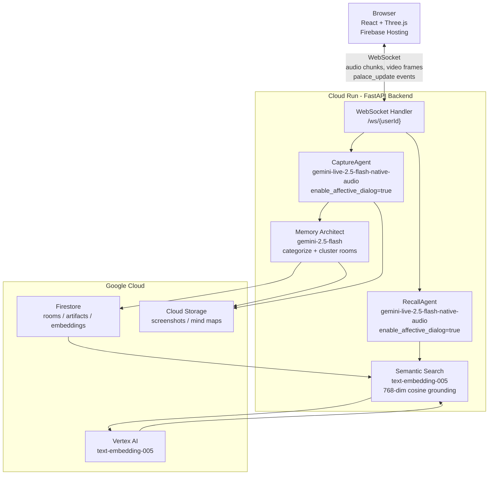

<div align="center">

# 🏛️ Rayan  -  AI Memory Palace

**Your mind, rendered in 3D. Live voice. Live camera. Live screen.**

[](https://rayan-memory.web.app)
[](https://ai.google.dev/)
[](https://ai.google.dev/)
[](https://cloud.google.com/run)
[](https://firebase.google.com/)
[](https://cloud.google.com/vertex-ai)
[](https://www.terraform.io/)
[](https://threejs.org/)
[](https://react.dev/)
[](https://fastapi.tiangolo.com/)
[](#hackathon)

---

*Turn everything you hear, see, and say into a living, walkable 3D world of memory.*

---

> We forget things. All the time. Not in some big philosophical way. In the most basic, embarrassing way.
> What did you eat yesterday? What was that person's name at the conference? What did your manager say two Fridays back?
>
> **The problem isn't capture.** We have more capture tools than ever.
> The problem is **retrieval**. Our memories are flat, unsearchable, disconnected from each other.
>
> Rayan fixes retrieval.

</div>

---

<!-- SCREENSHOT PLACEHOLDER -->
> **[Image: Full palace view  -  walkable 3D rooms with glowing artifact holograms, crystal orbs, and framed screenshots on the walls]**
<!-- Add screenshot: docs/images/palace-overview.png -->

---

## What Is Rayan?

Rayan is a **voice-first AI memory system** that transforms your knowledge into an explorable **3D Memory Palace**. Two persistent Gemini Live voice agents run simultaneously in the background:

- **CaptureAgent**  -  silently co-listens to your microphone and screen in real time, autonomously extracting key concepts and placing them as 3D artifacts inside themed rooms  -  no manual input required.
- **RecallAgent**  -  a persistent voice companion inside your 3D palace. Speak naturally, walk through your memories, and get instant, hallucination-free answers grounded exclusively in what you've actually captured.

The palace is not a metaphor. It's a fully rendered **Three.js 3D environment** you navigate in first-person  -  rooms, walls, glowing objects, and all.

---

<!-- DEMO GIF PLACEHOLDER -->
> **[GIF: Side-by-side of Capture mode extracting a concept from a lecture → artifact appearing in 3D palace in real time]**
<!-- Add demo gif: docs/images/capture-to-palace.gif -->

---

## ✨ Features

### 🎙️ Real-Time Voice Capture
Two-way audio streaming with **Gemini Live API** (`gemini-live-2.5-flash-native-audio`). The CaptureAgent listens passively alongside you  -  in meetings, lectures, podcasts, or conversations  -  and silently distills what matters.

### 🏛️ Living 3D Memory Palace
Your memories are not a list. They are a **fully navigable 3D environment** built with Three.js and React Three Fiber. Walk room to room in first-person, approach artifacts, and let spatial memory do what it was built to do.

<!-- SCREENSHOT PLACEHOLDER -->
> **[Image: First-person view inside a room  -  glowing hologram artifacts, crystal orbs, framed image artifacts on the walls]**
<!-- Add screenshot: docs/images/first-person-room.png -->

### 🧠 16 Distinct 3D Artifact Types
Captured knowledge is **typed and visually rendered** as one of 16 distinct 3D objects:

| Type | 3D Visual |
|------|-----------|
| Concept | Glowing hologram panel |
| Quote | Speech bubble |
| Formula | Crystal orb |
| Screenshot | Framed image on the wall |
| Person | Character model |
| Book | 3D book |
| Code | Terminal display |
| ...and 9 more | Unique 3D models per type |

### 🔍 Semantic Search Grounding (Zero Hallucination)
Every Recall answer is grounded by **`text-embedding-005`**  -  768-dimensional cosine similarity search over your stored memories. The system prompt enforces citation. Rayan cannot invent information that isn't in your palace.

### 🌐 Google Search Grounding (Live Web Knowledge)
Both the Capture and Recall agents have access to Gemini's built-in **`google_search`** tool — no external API key required. When a user asks about something not yet in their palace, the agent queries the live web mid-session and injects verified facts directly into its spoken response. This is native Gemini grounding, not a wrapper around a third-party search API.

### 💬 Affective Dialog
Both agents use `enable_affective_dialog=True`. Rayan modulates its vocal tone, pacing, and empathy in real time based on how you sound  -  matching your energy when you're excited, staying quiet when you're focused.

### 📸 Automatic Screenshot Capture
When the CaptureAgent sees a compelling slide or diagram on your screen, it autonomously calls `take_screenshot`, uploads to Cloud Storage, and places it as a framed visual artifact directly on your palace wall.

### 🗺️ AI Creative Synthesis
Ask Rayan to `synthesize_room` and `gemini-2.5-flash-image` generates a **creative visual summary** of all memories in that room — a styled, beautiful mind map image rendered live on the 3D wall. Each synthesis is unique to the room's theme: warm parchment for a Library, holographic panels for a Lab, painterly brushstrokes for a Gallery. It's not a diagram — it's a work of art that captures the shape of your knowledge.

<!-- SCREENSHOT PLACEHOLDER -->
> **[Image: A synthesized AI mind map rendered on the wall of a 3D palace room]**
<!-- Add screenshot: docs/images/mind-map-wall.png -->

### 🔁 Smart Deduplication
New captures are cosine-compared against everything saved this session. Near-duplicates (≥ 0.90 similarity) are **merged, not duplicated**  -  your palace stays clean.

### ⚡ Interruption-Aware Voice
The RecallAgent handles mid-sentence interruptions gracefully via Gemini Live's built-in VAD and the `interrupted` server event. Natural conversation, not a rigid Q&A.

### 🏗️ Auto-Clustering into Themed Rooms
The **Memory Architect** (`gemini-2.5-flash`) automatically categorizes and clusters captured concepts into themed rooms  -  no manual organization needed. Your palace structures itself.

### 🔒 Privacy-First
Screen data is analyzed in real time and only explicitly chosen screenshots are stored. No passive recording of your screen. You control what enters your palace.

### ☁️ One-Command Infrastructure
The entire GCP stack  -  Cloud Run, Firestore, Cloud Storage, Vertex AI Vector Search, Firebase Hosting, service accounts, IAM  -  is provisioned by a **single `terraform apply`**.

---

## 🚀 Quick Start

### Prerequisites

- GCP project with billing enabled
- APIs enabled: Cloud Run, Firestore, Cloud Storage, Vertex AI, Firebase
- Tools: `gcloud` CLI, `terraform >= 1.9`, `node >= 18`, `python 3.11`, `firebase-tools`
- Authenticated: `gcloud auth application-default login`

### 1. Clone

```bash
git clone <repo-url>
cd rayan
export PROJECT_ID=your-gcp-project-id
gcloud config set project $PROJECT_ID
```

### 2. Provision Infrastructure (one command)

```bash
cd infrastructure/terraform
terraform init
terraform apply \
  -var="project_id=$PROJECT_ID" \
  -var="backend_image=gcr.io/$PROJECT_ID/rayan-backend:latest"
```

This provisions Cloud Run, Firestore, Cloud Storage, Vertex AI Vector Search, service accounts, and IAM  -  everything.

### 3. Deploy Backend

```bash
cd backend
python -m venv venv && source venv/bin/activate
pip install -r requirements.txt

cat > .env << EOF
GOOGLE_CLOUD_PROJECT=$PROJECT_ID
MEDIA_BUCKET=rayan-media-$PROJECT_ID
EOF

# Local dev
uvicorn main:app --reload --port 8000

# Deploy to Cloud Run
gcloud builds submit --tag gcr.io/$PROJECT_ID/rayan-backend .
gcloud run deploy rayan-backend \
  --image gcr.io/$PROJECT_ID/rayan-backend \
  --region us-central1 \
  --allow-unauthenticated \
  --session-affinity \
  --set-env-vars GOOGLE_CLOUD_PROJECT=$PROJECT_ID,MEDIA_BUCKET=rayan-media-$PROJECT_ID
```

### 4. Deploy Frontend

```bash
cd frontend
npm install

BACKEND_URL=$(gcloud run services describe rayan-backend \
  --region us-central1 --format='value(status.url)')

cat > .env.local << EOF
VITE_WS_URL=wss://${BACKEND_URL#https://}/ws
VITE_API_URL=$BACKEND_URL
EOF

npm run build
firebase deploy --only hosting
```

### 5. Open Your Palace

Navigate to your Firebase Hosting URL, start a Capture session, and speak  -  your 3D palace builds itself.

---

## 🎯 How People Use Rayan

Rayan isn't a notes app. It's a **persistent second brain** you can walk through and talk to. Here are real ways it fits into your life:

### In Learning
- **Lecture companion**  -  run Capture in the background during any lecture or online course; your palace auto-fills with typed, searchable concepts as you listen
- **Textbook synthesis**  -  read aloud or screen-share; Rayan extracts and clusters key ideas into rooms by topic
- **Exam prep**  -  walk your palace before a test and ask Recall to quiz you on any room
- **Research rabbit holes**  -  capture browser tabs, articles, and papers across a session; Recall surfaces connections between them
- **Language learning**  -  capture vocabulary in context; Rayan stores definitions and example sentences as typed artifacts
- **Spaced repetition**  -  revisit your palace daily; spatial + voice recall is more durable than flashcards

### In Work
- **Meeting memory**  -  run Capture during any meeting; action items, decisions, and names are auto-extracted
- **Client onboarding**  -  capture everything discussed in the first week; Recall knows your client's context as well as you do
- **Engineering context**  -  capture technical decisions and architecture discussions; Recall answers "why did we do it this way?" months later
- **One-on-ones**  -  build a room per direct report; Recall surfaces what you discussed last time before every meeting
- **Competitive research**  -  capture competitor analysis sessions; your palace clusters insights by company automatically
- **Legal / compliance**  -  capture meeting notes and decisions with a traceable, grounded memory chain

### In Creative Work
- **Writing research**  -  capture sources, quotes, and ideas; Recall helps you cite and cross-reference while you write
- **Worldbuilding**  -  capture lore, character decisions, and plot threads; Recall keeps your fictional world consistent
- **Brainstorming**  -  capture every idea in a session; Recall finds patterns and connections across your messy ideation
- **Podcast prep**  -  capture notes and research across multiple sessions; walk your palace before recording

### In Personal Life
- **Travel planning**  -  capture recommendations, itineraries, and research; Recall answers "what was that restaurant someone mentioned?"
- **Medical**  -  capture doctor conversations and health research; Recall gives you grounded answers from your own notes
- **Relationships**  -  capture birthdays, preferences, and conversations; Recall makes sure you remember what matters to people
- **Learning a skill**  -  capture instructional content across weeks; your palace builds a structured curriculum automatically
- **Podcast and book ideas**  -  capture everything you consume; Recall surfaces relevant memories when you need them

### Power Features
- **Mid-conversation memory saves**  -  Recall can save new memories during a voice conversation without leaving the palace
- **Cross-session context**  -  everything persists; your palace from six months ago is fully searchable today
- **Room synthesis**  -  generate an AI mind map of any room on demand to visualize the shape of your knowledge
- **Real-time palace updates**  -  as Capture runs, new 3D artifacts appear in your palace live, no refresh needed

---

<!-- SCREENSHOT PLACEHOLDER -->
> **[Image: Composite showing Capture mode (left) and Recall voice session inside the 3D palace (right)]**
<!-- Add screenshot: docs/images/split-view-capture-recall.png -->

---

## 🏗️ Architecture

```
┌──────────────────────────────────────────────────────────────┐
│                       User's Browser                         │
│           React + Three.js  (Firebase Hosting)               │
│                                                              │
│  ┌────────────────┐   WebSocket /ws/{userId}   ┌──────────┐  │
│  │  Capture UI    │◄──────────────────────────►│          │  │
│  │  3D Palace     │                            │Cloud Run │  │
│  │  Voice UI      │◄──────────────────────────►│ FastAPI  │  │
│  └────────────────┘                            │          │  │
└────────────────────────────────────────────────┼──────────┘  │
                                                 │
                         ┌───────────────────────┼─────────────┐
                         │  Cloud Run  -  FastAPI│             │
                         │                       ▼             │
                         │  ┌─────────────────────────────┐    │
                         │  │ CaptureAgent                │    │
                         │  │ gemini-live-2.5-flash-      │    │
                         │  │ native-audio                │    │
                         │  │ enable_affective_dialog=True│    │
                         │  └──────────────┬──────────────┘    │
                         │                 │                   │
                         │  ┌──────────────▼──────────────┐    │
                         │  │ RecallAgent                 │    │
                         │  │ gemini-live-2.5-flash-      │    │
                         │  │ native-audio                │    │
                         │  │ enable_affective_dialog=True│    │
                         │  └──────────────┬──────────────┘    │
                         │                 │                   │
                         │  ┌──────────────▼────────────-──┐   │
                         │  │ Memory Architect             │   │
                         │  │ gemini-2.5-flash             │   │
                         │  │ categorize + cluster rooms   │   │
                         │  └──────────────┬─────────────-─┘   │
                         └─────────────────┼───────────────────┘
                                           │
              ┌────────────────────────────┼───────────────────┐
              │  Google Cloud              │                   │
              │             ┌──────────────▼────────────-─┐    │
              │             │  Firestore                  │    │
              │             │  users/{id}/rooms/          │    │
              │             │  users/{id}/rooms/artifacts │    │
              │             │  (embeddings stored inline) │    │
              │             └──────────────┬──────────────┘    │
              │                            │                   │
              │  ┌─────────────────────────▼──────────-───┐    │
              │  │  Vertex AI  text-embedding-005         │    │
              │  │  Semantic search grounding             │    │
              │  │  768-dim cosine similarity             │    │
              │  └────────────────────────────────────────┘    │
              │                                                │
              │  ┌────────────────────────────────────────┐    │
              │  │  Cloud Storage                         │    │
              │  │  Screenshots / AI mind map images      │    │
              │  └────────────────────────────────────────┘    │
              └────────────────────────────────────────────────┘
```



---

## 🔬 How Rayan Avoids Hallucination

Every Recall session is semantically grounded before Rayan speaks a single word:

1. On session start, `_retrieve_context()` embeds your current artifact summary via **`text-embedding-005`**
2. It runs cosine similarity search across every stored artifact embedding in Firestore
3. The **top-8 most semantically relevant memories** are injected into the live system prompt under `MEMORIES:`
4. The system prompt enforces: *"ONLY use information from the provided MEMORIES section. NEVER hallucinate or invent information. Cite which artifact/room the information comes from."*
5. On every room navigation and artifact highlight, `update_context()` re-runs the search and injects fresh memories mid-conversation via `send_client_content`  -  no reconnection needed

---

## 🎭 Affective Dialog

Both `CaptureAgent` and `RecallAgent` use `enable_affective_dialog=True`:

```python
config = genai_types.LiveConnectConfig(
    response_modalities=["AUDIO"],
    enable_affective_dialog=True,          # Rayan adapts to your emotional tone
    system_instruction=system_prompt,
    ...
)
```

Gemini naturally adjusts its vocal tone, pacing, and empathy based on your emotional cues. When you sound excited, Rayan matches that energy. When you sound tired, it stays quieter. This makes Rayan feel like a genuine presence, not a tool.

---

## 🛠️ Tech Stack

| Layer | Technology |
|-------|-----------|
| Frontend | TypeScript 5, React 18, Three.js, @react-three/fiber |
| 3D Engine | Three.js  -  first-person navigation, 16 artifact types, procedural rooms |
| Backend | Python 3.11, FastAPI, WebSockets |
| AI  -  Live Agents | Gemini Live API (`gemini-live-2.5-flash-native-audio`) |
| AI  -  Categorization | `gemini-2.5-flash` |
| AI  -  Creative Synthesis | `gemini-2.5-flash-image` — generates styled mind map images to visually summarize room memories |
| AI  -  Semantic Grounding | Vertex AI `text-embedding-005` (768-dim cosine similarity) |
| SDK | Google GenAI SDK (`google-genai`), Google ADK (`google-adk`) |
| Database | Cloud Firestore |
| Storage | Cloud Storage (screenshots + mind maps) |
| Hosting | Cloud Run (backend, session affinity), Firebase Hosting (frontend) |
| Infrastructure | Terraform (`infrastructure/terraform/`)  -  single `apply` |

---

## 📁 Project Structure

```
rayan/
├── backend/
│   ├── app/
│   │   ├── agents/
│   │   │   ├── capture_agent.py      # Gemini Live capture session
│   │   │   ├── recall_agent.py       # Gemini Live recall session
│   │   │   ├── memory_architect.py   # Categorization + room clustering
│   │   │   └── tools/tools.py        # Tool declarations for both agents
│   │   ├── services/
│   │   │   ├── search_service.py     # Semantic search (Vertex AI embeddings)
│   │   │   ├── embedding_service.py  # text-embedding-005 via Vertex AI
│   │   │   ├── synthesis_service.py  # AI mind map generation
│   │   │   ├── room_service.py       # Room CRUD
│   │   │   └── artifact_service.py   # Artifact CRUD
│   │   ├── websocket/
│   │   │   └── handlers.py           # WebSocket event router
│   │   └── core/
│   │       └── gemini.py             # GenAI client (Vertex AI backend)
│   ├── requirements.txt
│   └── main.py
├── frontend/
│   └── src/
│       ├── components/               # React components (Palace, Capture, Voice)
│       ├── hooks/                    # useCapture, useWS, useAmbientMusic
│       └── pages/PalacePage.tsx
├── infrastructure/
│   └── terraform/
│       └── main.tf                   # Full GCP infrastructure as code
└── README.md
```

---

## ⚙️ Environment Variables

| Variable | Description |
|----------|-------------|
| `GOOGLE_CLOUD_PROJECT` | GCP project ID |
| `MEDIA_BUCKET` | Cloud Storage bucket for screenshots and mind maps |
| `GOOGLE_APPLICATION_CREDENTIALS` | Path to service account JSON (local dev only; Cloud Run uses attached SA) |
| *(no key needed)* | Web search uses Gemini's built-in `google_search` grounding tool via Vertex AI — no Custom Search API required |

---

## 🧑‍💻 Development Commands

```bash
# Backend
cd backend && source venv/bin/activate
uvicorn main:app --reload --port 8000
ruff check . && ruff format .

# Frontend
cd frontend
npm run dev
npm run lint
npm test
```

---

## 🏆 Hackathon Submission <a name="hackathon"></a>

| Field | Value |
|-------|-------|
| **Challenge** | Gemini Live Agent Challenge  -  `#GeminiLiveAgentChallenge` |
| **Category** | Live Agents |
| **Mandatory tech** | Gemini Live API (`gemini-live-2.5-flash-native-audio`), Google GenAI SDK, Google ADK, Cloud Run |
| **Image synthesis** | `gemini-2.5-flash-image` — creative visual summaries of room memories rendered as 3D palace wall art |
| **Google Cloud services** | Cloud Run, Firestore, Cloud Storage, Vertex AI (embeddings + Vector Search), Firebase Hosting |
| **Infrastructure** | Terraform  -  fully automated, single `terraform apply` |
| **Developer** | [g.dev/yelnady](https://g.dev/yelnady) |

---

<div align="center">

Built with the **Gemini Live API**  -  Google GenAI SDK  -  Google ADK  -  Cloud Run  -  Vertex AI  -  Terraform

*A 3D memory palace that listens, remembers, and speaks back.*

</div>
